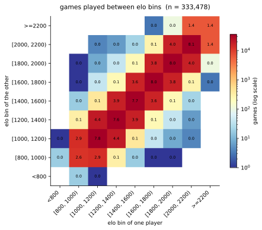

# chess-ml

Predict the rating bin of a chess game from the game itself (moves, clock times,
opening, time control). One prediction per game, label from the average Elo of
both players. Data: Lichess rapid games, April–June 2017.

**Status: data pipeline and splits done, no trained model yet.**
Details and design decisions: [docs/report.pdf](docs/report.pdf).

## Status

- [x] Sampling: stratified reservoir sampling, 333k games from 34.6M
- [x] Player-disjoint train/test split (229k / 9.7k games)
- [x] Basic features (opening family, time control, merged 7 Elo bins)
- [x] Baselines: majority class 16.6 % accuracy (7 classes)
- [ ] Stockfish features (pipeline and calibration done, depth not yet chosen)
- [ ] PGN features (clock usage, development, castling)
- [ ] XGBoost baseline and evaluation

## Key numbers

| | |
|---|---|
| Games read / eligible / sampled | 34.6M / 4.53M / 333k |
| Train / test games | 229,402 / 9,666 (player-disjoint) |
| Classes | 7 Elo bins, <1000 … ≥2000 |
| Majority-class accuracy (test) | 16.6 % |

The split drops 28 % of the sampled games, because a game is only usable if both
players are on the same side. See the report for why and what it costs.



## Reproduce

Needs Python 3.12, `pip install -r requirements.txt`, and the three monthly
`lichess_db_standard_rated_2017-0{4,5,6}.pgn.zst` dumps from
[database.lichess.org](https://database.lichess.org) in `data/raw/`.

```bash
python src/sampling/sample_games.py --input data/raw/*.pgn.zst
python src/sampling/backfill_headers.py --pool data/sampled/sampled_games.parquet \
    --input data/raw/*.pgn.zst --output data/sampled/sampled_games_enriched.parquet
python -m src.splitting.split_players --write-games
python -m src.features.basic_features
```

Sampling takes about 13 h single-threaded.

## Layout

```
src/sampling/            filtering + sampling, header backfill
src/splitting/           player-disjoint split
src/features/            feature engineering
src/data_visualization/  player graph analysis
notebooks/               exploration, baselines, graph
docs/                    report (tex + pdf)
```

## Related work

- Tijhuis et al. (2023): hand-crafted features, 10-class rating classification, ~17 % accuracy.
- Omori & Tadepalli (2024): CNN-LSTM rating regression, MAE 182.
- McIlroy-Young et al. (2020), Maia Chess: predicts moves, not ratings.

## Limitations

Rapid only, similar-rated opponents only (±100 Elo), 2017 data, no player metadata.
